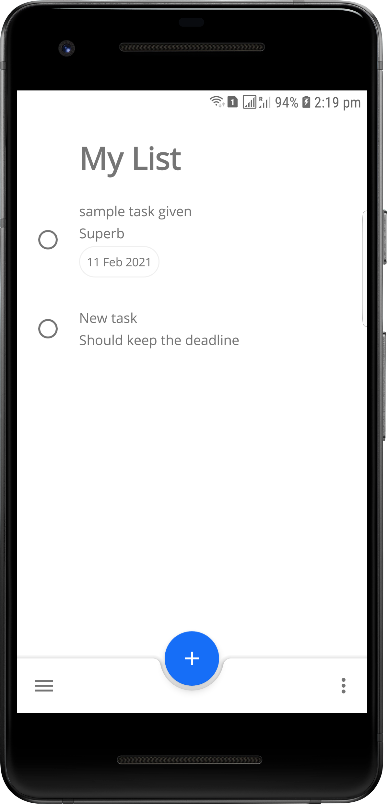
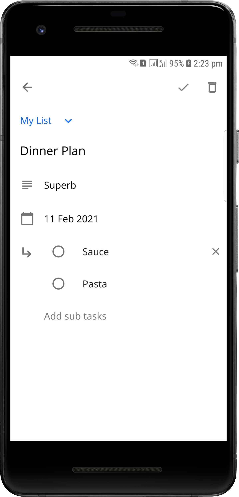
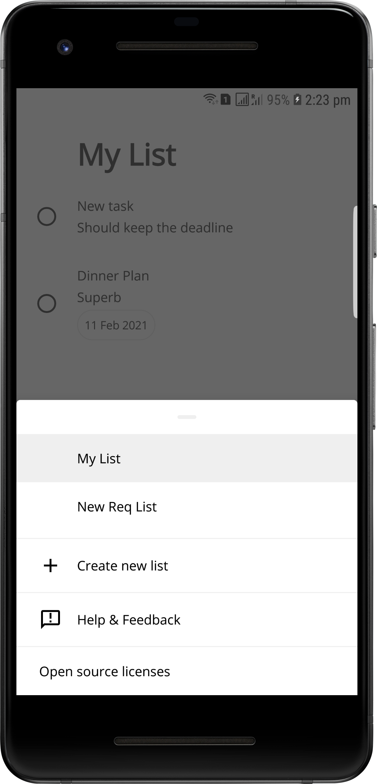
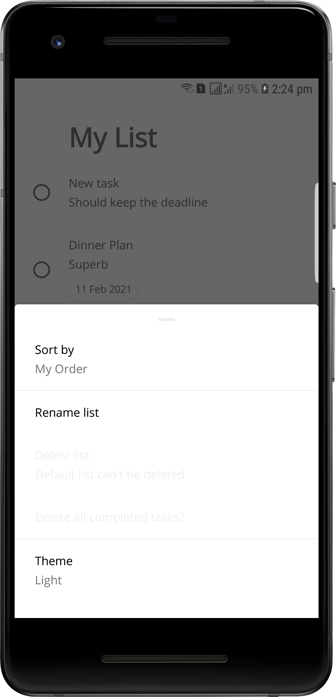

# To-Do

[](.github/workflows/workflow.yml)
[](https://ktlint.github.io/)

To-Do is constructed to notedown the tasks and get notified with notification.

It displays list to manage different types.

<br>

| List | Details | Task Group List | Filters |
| ------ | ----- | ------ | ----- |
|  |  |  |  |

## Android development


Ranker attempts to make use of the latest Android libraries and best practices:
* Entirely written in [Kotlin](https://kotlinlang.org/) (including [Coroutines](https://kotlinlang.org/docs/reference/coroutines-overview.html) and [Flow](https://kotlinlang.org/docs/reference/coroutines/flow.html)) with [ktlint](https://github.com/pinterest/ktlint) for code style
* Makes use of [Android Jetpack](https://developer.android.com/jetpack/):
  * [Architecture Components](https://developer.android.com/jetpack/arch/) including **ViewModel**, **LiveData**, **Navigation**, **WorkManager** and **DataStore**
  * [ConstraintLayout](https://developer.android.com/reference/androidx/constraintlayout/widget/ConstraintLayout), [View Binding](https://developer.android.com/topic/libraries/view-binding) and more for layouts and UI
  * [Android KTX](https://developer.android.com/kotlin/ktx) for more fluent use of Android APIs
* Designed and built using Material Design [components](https://material.io/components/) and [theming](https://material.io/design/material-theming/overview.html#material-theming)
* Full [dark theme](https://material.io/design/color/dark-theme.html) support
* Meaningful use of [Material Motion](https://material.io/design/motion/the-motion-system.html) transition
* SQLDelight is used to store data as common for both android & iOS [SQL Delight](https://github.com/cashapp/sqldelight)

## Inspiration

ToDo was inspired by [@google-tasks](https://play.google.com/store/apps/details?id=com.google.android.apps.tasks&hl=en_IN&gl=US) app, aiming to be a kotlin-kmm app to support both Andorid & iOS.

## Contributions

Please feel free to file an issue for errors, suggestions or feature requests. Pull requests are also encouraged.

## License

```
Copyright 2020 Naveen Kumar Kuppan

Licensed to the Apache Software Foundation (ASF) under one or more contributor
license agreements. See the NOTICE file distributed with this work for
additional information regarding copyright ownership. The ASF licenses this
file to you under the Apache License, Version 2.0 (the "License"); you may not
use this file except in compliance with the License. You may obtain a copy of
the License at

   http://www.apache.org/licenses/LICENSE-2.0

Unless required by applicable law or agreed to in writing, software
distributed under the License is distributed on an "AS IS" BASIS, WITHOUT
WARRANTIES OR CONDITIONS OF ANY KIND, either express or implied. See the
License for the specific language governing permissions and limitations under
the License.
```
